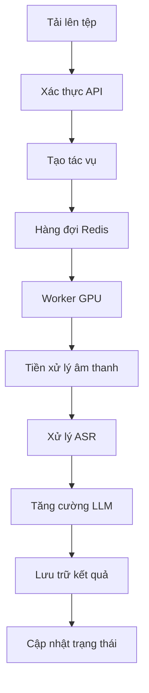

# Hướng dẫn Vận hành và Kiến trúc AI C500

## 🏗️ Kiến trúc hệ thống

AI C500 (Hệ thống Phân tích Âm thanh Thông minh) là hệ thống phân tán ba tầng sẵn sàng sản xuất được thiết kế để triển khai tại chỗ các khối lượng công việc xử lý âm thanh. Kiến trúc cho phép xử lý hiệu quả các tệp âm thanh thông qua quy trình tinh vi bao gồm tiền xử lý âm thanh, nhận dạng giọng nói tự động (ASR) và tăng cường mô hình ngôn ngữ lớn (LLM).

### Nguyên tắc thiết kế

- **Xử lý GPU tuần tự**: Được thiết kế cho các ràng buộc VRAM 16-24GB với quản lý vòng đời mô hình rõ ràng.
- **Kiến trúc mô-đun**: Hỗ trợ nhiều backend ASR (Whisper, ChunkFormer) thông qua mẫu thiết kế Factory.
- **Xử lý dựa trên mẫu**: Tạo đầu ra có cấu trúc bằng mẫu JSON.
- **Cấu hình an toàn**: Cấu hình dựa trên Pydantic với hỗ trợ biến môi trường.
- **Xử lý lỗi toàn diện**: Xử lý lỗi có cấu trúc với ghi log chi tiết.

### Kiến trúc ba tầng

AI C500 triển khai kiến trúc ba tầng được tối ưu hóa cho các khối lượng công việc xử lý âm thanh chuyên sâu GPU:

```
┌─────────────────────────────────────────────────────────────────┐
│                           Lớp API                               │
│                    (Khung web Litestar)                         │
├─────────────────────────────────────────────────────────────────┤
│                      Lớp hàng đợi                               │
│                (Redis + RQ Task Queue)                          │
├─────────────────────────────────────────────────────────────────┤
│                     Lớp Worker                                  │
│              (Worker GPU với xử lý tuần tự)                     │
└─────────────────────────────────────────────────────────────────┘
```

### Phân tích thành phần

#### 1. Lớp API (Tầng trình bày)

- **Công nghệ**: Khung web [Litestar](https://litestar.dev/)
- **Trách nhiệm**: Cung cấp các điểm cuối REST API không trạng thái, xử lý tải lên và xác thực tệp, quản lý xác thực và ủy quyền, tạo tác vụ và cho phép thăm dò trạng thái.
- **Cấu hình chính**:
  - `API_HOST`, `API_PORT`: Địa chỉ và cổng máy chủ.
  - `SECRET_API_KEY`: Khóa xác thực.
  - `MAX_FILE_SIZE_MB`: Giới hạn kích thước tệp tải lên.

#### 2. Lớp hàng đợi (Tầng logic)

- **Công nghệ**: Redis với RQ (Redis Queue)
- **Trách nhiệm**: Phân phối và cân bằng tải tác vụ, xử lý công việc nền, và giám sát độ sâu hàng đợi.
- **Cấu hình chính**:
  - `REDIS_URL`: URL kết nối Redis.
  - `REDIS_RESULTS_DB`: Cơ sở dữ liệu Redis để lưu trữ kết quả.
  - `MAX_QUEUE_DEPTH`: Độ sâu hàng đợi tối đa để chống áp lực.

#### 3. Lớp Worker (Tầng dữ liệu)

- **Công nghệ**: Worker Python RQ với tăng tốc GPU.
- **Trách nhiệm**: Thực thi quy trình xử lý tuần tự, quản lý vòng đời mô hình (tải → thực thi → dỡ tải), và tối ưu hóa bộ nhớ GPU.
- **Cấu hình chính**:
  - `WORKER_CONCURRENCY`: Số lượng quy trình worker đồng thời.
  - `JOB_TIMEOUT`: Thời gian chờ tối đa cho một công việc.
  - Cấu hình mô hình chi tiết (ASR, LLM) để quản lý tài nguyên GPU.

### Luồng dữ liệu

Quy trình xử lý từ đầu đến cuối của một yêu cầu trong AI C500:



### Mẫu thiết kế

- **Factory Pattern**: Được sử dụng trong `ASRFactory` để tạo các backend ASR khác nhau (`Whisper`, `ChunkFormer`) một cách linh hoạt, cho phép dễ dàng mở rộng với các mô hình mới.
- **Template Method Pattern**: Quy trình xử lý trong `pipeline.py` tuân theo một chuỗi các bước cố định (tiền xử lý, ASR, LLM), đảm bảo thực thi tuần tự và quản lý tài nguyên nhất quán.
- **Observer Pattern**: Trạng thái tác vụ trong Redis được cập nhật ở mỗi giai đoạn, cho phép máy khách "quan sát" tiến trình bằng cách thăm dò điểm cuối trạng thái.

### Ngăn xếp công nghệ

| Thành phần        | Công nghệ        | Mục đích                            |
| ---------------- | ----------------- | ---------------------------------- |
| Khung web    | Litestar          | REST API hiệu suất cao với OpenAPI.      |
| Hàng đợi tác vụ       | Redis + RQ        | Xử lý công việc nền không đồng bộ.          |
| Cấu hình    | Pydantic Settings | Quản lý cấu hình an toàn, dựa trên môi trường. |
| Xử lý âm thanh | PyTorch           | Khung học sâu cho các hoạt động GPU.            |
| Suy luận LLM    | vLLM              | Phục vụ LLM hiệu suất cao.       |
| Backend ASR      | OpenAI Whisper    | Nhận dạng giọng nói chất lượng cao.                 |
| Backend ASR      | ChunkFormer       | ASR phát trực tuyến cho tiếng Việt.       |

### Cân nhắc hiệu suất

- **Quản lý VRAM**: Kiến trúc được thiết kế để tải và dỡ tải các mô hình (ASR, LLM) một cách tuần tự, cho phép hoạt động trong môi trường có VRAM hạn chế (16-24GB). Bộ nhớ đệm CUDA được xóa một cách rõ ràng sau mỗi bước để giải phóng tài nguyên.
- **Hệ số thời gian thực (RTF)**: Hệ thống tính toán RTF để đo lường hiệu suất xử lý, cho biết tốc độ xử lý nhanh hơn hay chậm hơn thời gian thực.
- **Lượng tử hóa**: Hỗ trợ các loại tính toán lượng tử hóa (ví dụ: `int8_float16`) để giảm mức sử dụng bộ nhớ và tăng tốc độ suy luận với tác động tối thiểu đến độ chính xác.

## ⚙️ Hướng dẫn cấu hình

AI C500 sử dụng hệ thống cấu hình dựa trên Pydantic, cho phép thiết lập thông qua các biến môi trường.

### Yêu cầu Hệ thống

#### Yêu cầu Phần cứng

Để chạy AI C500 hiệu quả, đặc biệt là với các tác vụ xử lý GPU, hệ thống của bạn nên đáp ứng các yêu cầu sau:

-   **CPU**: Tối thiểu 4 nhân (khuyến nghị 8+ nhân)
-   **RAM**: Tối thiểu 16GB (khuyến nghị 32GB+)
-   **Lưu trữ**: Ổ SSD tối thiểu 100GB để chứa các mô hình AI và dữ liệu âm thanh.
-   **GPU**: Card đồ họa NVIDIA với ít nhất 16GB VRAM. Khuyến nghị 24GB+ VRAM để có hiệu suất tối ưu và khả năng xử lý các mô hình lớn hơn.

#### Kiến trúc GPU được hỗ trợ

Hệ thống tương thích với các kiến trúc GPU NVIDIA sau:

-   Pascal (ví dụ: GTX 10-series, Tesla P100)
-   Turing (ví dụ: RTX 20-series, Tesla T4)
-   Ampere (ví dụ: RTX 30-series, A100)
-   Ada Lovelace (ví dụ: RTX 40-series)

### Thiết lập môi trường

1.  **Sao chép kho mã nguồn:**
    ```bash
    git clone <repository-url>
    cd maie
    ```

2.  **Tạo tệp `.env`:**
    ```bash
    cp .env.template .env
    ```
    Sau đó, chỉnh sửa tệp `.env` với các giá trị cấu hình của bạn.

3.  **Tải mô hình:**
    ```bash
    pixi run download-models
    ```

### Biến môi trường chính

#### Cấu hình API

| Biến | Mô tả | Mặc định |
|----------|-------------|---------|
| `API_HOST` | Địa chỉ liên kết máy chủ API | `0.0.0.0` |
| `API_PORT` | Cổng máy chủ API | `8000` |
| `SECRET_API_KEY` | Khóa xác thực API | `your_secret_api_key_here` |
| `MAX_FILE_SIZE_MB` | Kích thước tệp tải lên tối đa (MB) | `500.0` |

#### Cấu hình Redis

| Biến | Mô tả | Mặc định |
|----------|-------------|---------|
| `REDIS_URL` | URL kết nối Redis | `redis://localhost:6379/0` |
| `REDIS_RESULTS_DB` | Số DB Redis cho kết quả | `1` |
| `MAX_QUEUE_DEPTH` | Kích thước hàng đợi tối đa | `50` |

#### Cấu hình Mô hình ASR (Whisper)

| Biến | Mô tả | Mặc định |
|----------|-------------|---------|
| `WHISPER_MODEL_VARIANT` | Biến thể mô hình Whisper | `erax-wow-turbo` |
| `WHISPER_DEVICE` | Thiết bị tính toán (`cuda` hoặc `cpu`) | `cuda` |
| `WHISPER_COMPUTE_TYPE` | Loại lượng tử hóa | `float16` |

#### Cấu hình Mô hình LLM

| Biến | Mô tả | Mặc định |
|----------|-------------|---------|
| `LLM_ENHANCE_MODEL` | Đường dẫn mô hình tăng cường | `data/models/qwen3-4b-instruct-2507-awq` |
| `LLM_SUM_MODEL` | Đường dẫn mô hình tóm tắt | `cpatonn/Qwen3-4B-Instruct-2507-AWQ-4bit` |
| `LLM_ENHANCE_GPU_MEMORY_UTILIZATION` | Tỷ lệ sử dụng bộ nhớ GPU | `0.9` |

#### Cấu hình Worker

| Biến | Mô tả | Mặc định |
|----------|-------------|---------|
| `WORKER_NAME` | Định danh worker | `maie-worker` |
| `JOB_TIMEOUT` | Thời gian chờ công việc (giây) | `600` |
| `RESULT_TTL` | Thời gian lưu giữ kết quả (giây) | `86400` |
| `WORKER_CONCURRENCY` | Số quy trình worker | `2` |

### Cấu hình Docker

Tệp `docker-compose.yml` cung cấp một cách dễ dàng để triển khai AI C500 trong môi trường container.

```yaml
version: "3.8"

services:
  redis:
    image: redis:7-alpine
    ports:
      - "6379:6379"

  api:
    build:
      context: .
      target: production
    ports:
      - "8000:8000"
    environment:
      - REDIS_URL=redis://redis:6379/0
      - SECRET_API_KEY=${SECRET_API_KEY}

  worker:
    build:
      context: .
      target: production
    deploy:
      resources:
        reservations:
          devices:
            - driver: nvidia
              device_ids: ["0"]
              capabilities: [gpu]
```

### Khả năng mở rộng và Triển khai

- **Mở rộng quy mô Worker**: Tăng số lượng `worker` trong `docker-compose.yml` để xử lý nhiều tác vụ hơn đồng thời.
- **Cân bằng tải**: Sử dụng một bộ cân bằng tải (ví dụ: Nginx) phía trước các dịch vụ `api` để phân phối lưu lượng truy cập.
- **Cụm Redis**: Đối với các thiết lập quy mô lớn, hãy sử dụng một cụm Redis chuyên dụng.

### Bảo mật

- **Khóa API**: Sử dụng khóa API mạnh và luân chuyển chúng định kỳ.
- **Mạng**: Chạy Redis và các worker trên một mạng nội bộ không thể truy cập từ bên ngoài.
- **Bảo mật tệp tải lên**: Đảm bảo xác thực kích thước và loại tệp được bật.

### Khắc phục sự cố

- **Vấn đề kết nối Redis**: Đảm bảo dịch vụ Redis đang chạy và có thể truy cập được từ các container `api` và `worker`.
- **Lỗi bộ nhớ GPU**: Nếu bạn gặp lỗi hết bộ nhớ CUDA, hãy thử giảm `LLM_..._GPU_MEMORY_UTILIZATION` hoặc sử dụng các mô hình được lượng tử hóa nhỏ hơn (`WHISPER_COMPUTE_TYPE=int8`).
- **Vấn đề tải mô hình**: Kiểm tra xem các đường dẫn mô hình trong `.env` là chính xác và các tệp mô hình tồn tại.
